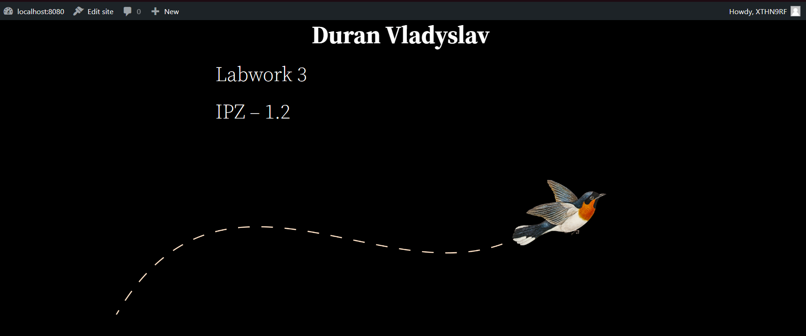
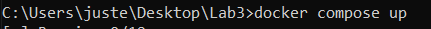
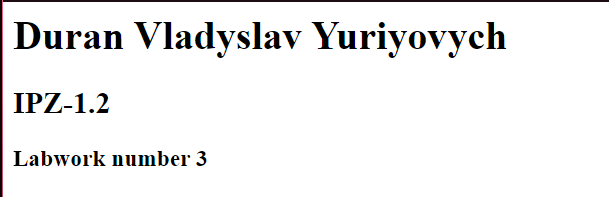
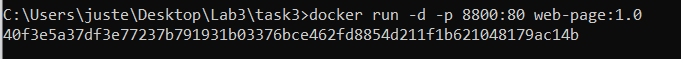
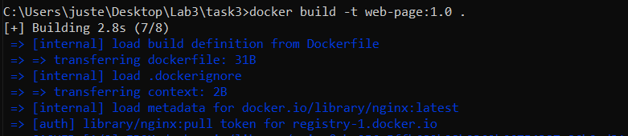
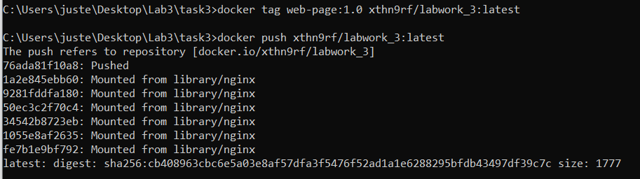
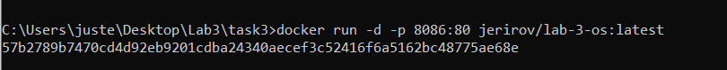
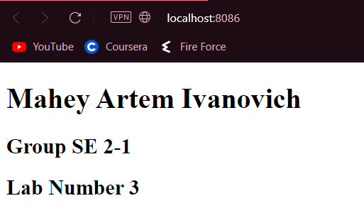

# Лабораторна робота №3. Docker

## План:

- Використання готових Docker Images.
- Використання Docker Compose.
- Створення HTML сторінки та занесення її в Docker Image.
- Залити даний Docker Image на Docker Hub.
- Скачати Docker Image когось із групи і розвернути в себе контейнер з HTML сторінкою на порті 8086 ззовні.

## Виконав студент ІІІ курсу: 
## Напрям "ІПЗ", група 1.2
## Дуран Владислав Юрійович 

---

## 1. Використання готових Docker Images.

---
  #### <strong> Завдання </strong>
   Ознайомитись із готовими Docker Images які знаходяться на Docker Hub. Використати образ wordpress та розвернути сайт із безкоштовною темою.

---

Спочатку я запулив імейдж вордпреса з Docker hub за допомогою команди: <strong> docker pull wordpress </strong> <br/>

За прикладом з сайту я написав свій compose.yml файл, змінивши усі рядки з "example" на користувацькі та версію на 3.8 <br/>

---

```
version: '3.8'
 
services:
 
  wordpress:
    image: wordpress
    restart: always
    ports:
      - 8080:80
    environment:
      WORDPRESS_DB_HOST: db
      WORDPRESS_DB_USER: MYSQL_USER
      WORDPRESS_DB_PASSWORD: MYSQL_PASSWORD
      WORDPRESS_DB_NAME: MYSQL_DATABASE
    volumes:
      - wordpress:/var/www/html
    depends_on:
      - db
 
  db:
    container_name: db
    image: mysql
    restart: always
    environment:
      MYSQL_DATABASE: MYSQL_DATABASE
      MYSQL_USER: MYSQL_USER
      MYSQL_PASSWORD: MYSQL_PASSWORD
      MYSQL_ROOT_PASSWORD: MYSQL_ROOT_PASSWORD
    volumes:
      - db:/var/lib/mysql
    ports:
      - 9906:3306
 
volumes:
  wordpress:
  db:

```


<strong> Сайт на вордперсі, що запущений на порті 8080 </strong> <br/>


## 2. Використання Docker Compose.
---
  #### <strong> Завдання </strong>
  Описати теоретично що таке Docker Compose, чому саме розширення .yml а також навести переваги та недоліки його використання. Навести приклад створення та збирання образа за допомогою Docker Compose.

---
### <strong> Описати теоритично що таке Docker Compose </strong>
---
   За допомогою Compose ви використовуєте файл YAML для налаштування служб програми. Потім за допомогою однієї команди ви створюєте та запускаєте всі служби з вашої конфігурації.

---
### <strong> Чому YAML? </strong>
---
  YAML — це мова серіалізації даних, яка часто використовується для написання конфігураційних файлів. YAML є популярною мовою програмування, оскільки її легко читати та легко зрозуміти. Його також можна використовувати в поєднанні з іншими мовами програмування. Завдяки своїй гнучкості та доступності YAML використовується інструментом автоматизації Ansible для створення процесів автоматизації у формі Ansible Playbooks.

---

### <strong> Переваги YAML у порівнянні з JSON та XML </strong>

---
  У YAML не використовується додатковий роздільник. Тому він легший, ніж XML і JSON.
  YAML, без використання розділювача також робить читання легким і простим. (Я не впевнений, чи погоджуєтеся ви з цією думкою. Тому що багатьом фанатам легше читати дані за допомогою розділювача вмісту або тегів, які їх розділяють.) YAML полегшує розуміння даних. Тому це корисно у випадку конфігурації.
  Багато проблем із безпекою в мовах програмування пов’язані з аналізом ненадійного введення (наприклад, JSON). Python, Ruby, Java, JavaScript, PHP тощо дозволяють зловмисникам використовувати ці вразливості, обходячи неочікувані вхідні рядки для аналізатора. YAML розроблено для запобігання таким типам експлойтів, вказуючи, з якого типу даних має складатися кожна частина потоку YAML.

---

### <strong> Недоліки YAML у порівнянні з JSON та XML </strong>

---
  Існує так багато програм, які вже створено з використанням XML або JSON, тому розробнику важко замінити це YAML.
  Якщо говорити про популярність, XML має набагато більш зрілу екосистему, ніж YAML. JSON [JavaScript Object Notation] існує з початку 2000-х років, і багато хто його сприймає порівняно з YAML. Тому легше знайти підтримку JSON замість YAML.
  Існують додаткові застереження під час написання коду YAML. Навіть якщо ви не зберете один пробіл під час відступу, ваш код може перестати працювати.
  Існує багато способів представлення даних у YAML та створення ієрархії даних. Тому він складний для обробки. Тому JSON і XML мають кращу продуктивність, ніж YAML.

---

<strong> За допомогою файлу compose.yml я запустив команду compose up </strong> <br/>



## 3. Створення HTML сторінки та занесення її в Docker Image.
---
#### <strong> Завдання </strong>
  1) Створити HTML сторінку із вашим ПІБ, групою та № Л.Р..
  2) Створити Docker Image із цією сторінкою.
  3) Реалізувати можливість запуску цієї сторінки з контейнера (потрібно sudo usermod -aG docker username сервер NGINX до прикладу).
  4) Перевірити на працездатність контейнера на основі вашого образу.
  5) Залити готовий образ на Docker Hub.
   
---
### Вигляд створеної html-сторінки
```
    <!DOCKTYPE hmtl>
    <html>
        <head> 
            <title>OS_Lab 3</title> 
        </head>
        <body>
        <h1> Duran Vladyslav Yuriyovych</h1>
        <h2>IPZ-1.2</h2>
        <h3>Labwork number 3</h3>
        </body>
    </hmtl>
```
<strong>Вигляд запущеної веб-сторінки</strong>

<strong> Вигляд Dockerfile </strong>
```
    FROM nginx
    COPY . /usr/share/nginx/html
```
<strong>Запуск веб-сторінки за допомогою docker</strong> <br/>


<strong> Білд імейджа </strong> <br/>


<strong> Пуш імейджа на Docker Hub</strong> <br/>


<strong>Посилання на мій Docker Hub <strong>
[Репозиторій](https://hub.docker.com/repository/docker/xthn9rf/labwork_3)

## 4. Скачати Docker Image когось із групи і розвернути в себе контейнер з HTML сторінкою на порті 8086 ззовні.

---
Я скачав імейдж Артема Магея з його [Dockerhub](https://hub.docker.com/r/jerirov/lab-3-os) за допомогою команди docker pull

---

<strong> Запуск імейджу Артема за допомогою docker на порті 8086</strong> <br/>


<strong> Вигляд запущеної сторінки </strong> <br/>
