# Лабораторна робота №4

## Тема: "Створення сценарію terraform для надання інфраструктури в хмарі GCP (або AWS)"

Виконав студент ІІІ курсу

Напрям "ІПЗ", група 1.2

Дуран Владислав Юрійович

### План:
1. Створіть один екземпляр (зображення: ubuntu 20.04)

Перед виконанням цього завдання я створив акаунт на AWS та встановив тераформ на убунту (за допомогою sudo apt install terraform)

У графічному інтерфейсі AWS я отримав secret та access ключі щоб в подальшому використати їх у своєму конфіг-файлі


Далі я виконав команду terraform init


Після чого terraform plan

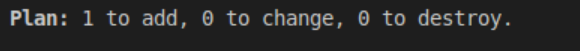

Далі terraform apply

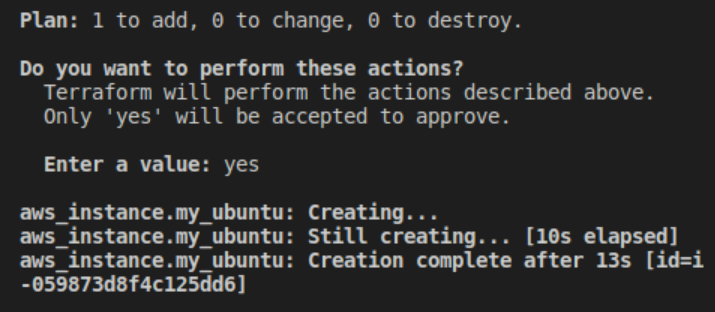

Вигляд інтерфейсу в AWS

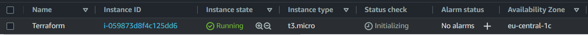

2. Дозвольте трафік HTTP/HTTPS на мережевому адаптері

На AWS я створив security_group, де поставив дозволи для трафіку через HTTP та HTTPS

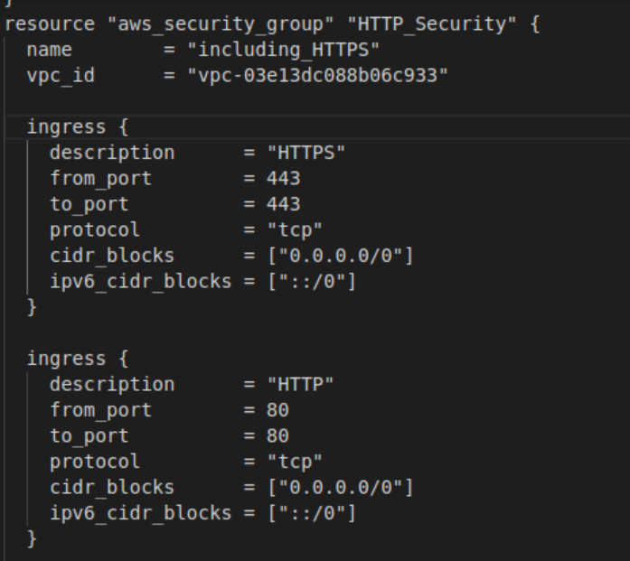

Після чого запустив команди:

```
terraform plan
terraform apply
```

Вигляд інтерфейсу в AWS

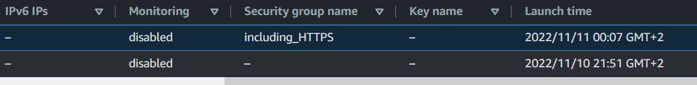

3. Надайте один відкритий ключ SSH для створеного екземпляра

Генерація ssh ключів (паблік та прайват)

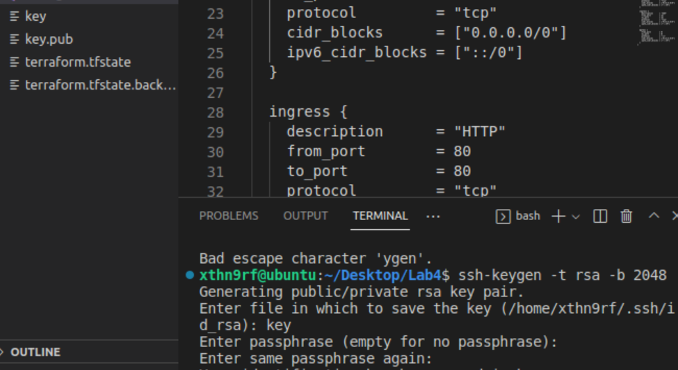

Також потрібно додати у конфіг ці рядки:

```
ingress {
    description = "SSH"
    from_port = 22
    to_port = 22
    protocol = "tcp"
    cidr_blocks = ["0.0.0.0/0"]
    ipv6_cidr_blocks = ["::/0"]
}
```

Далі додаю ключ до конфігу та дописую його до resource 

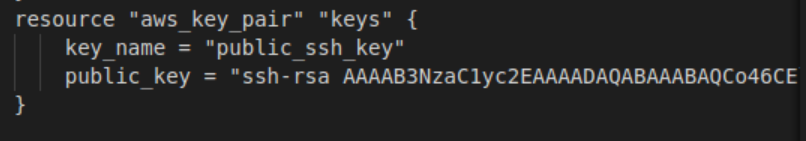


4. Встановіть веб-сервер (HTTP-сервер Apache / HTTP-сервер NGINX) за сценарієм bash

На сайті AWS знаходжу команду підключення до інстансу через SSH

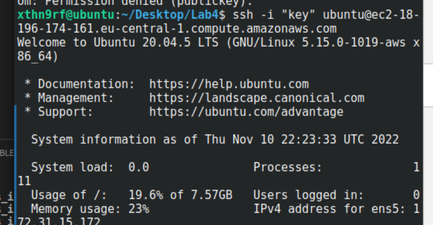

Далі я створив баш скрипт для встановлення та запуску сервера

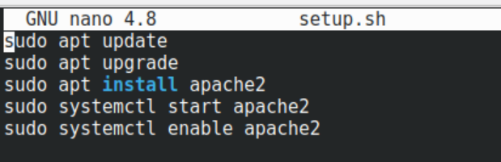

Запуск баш

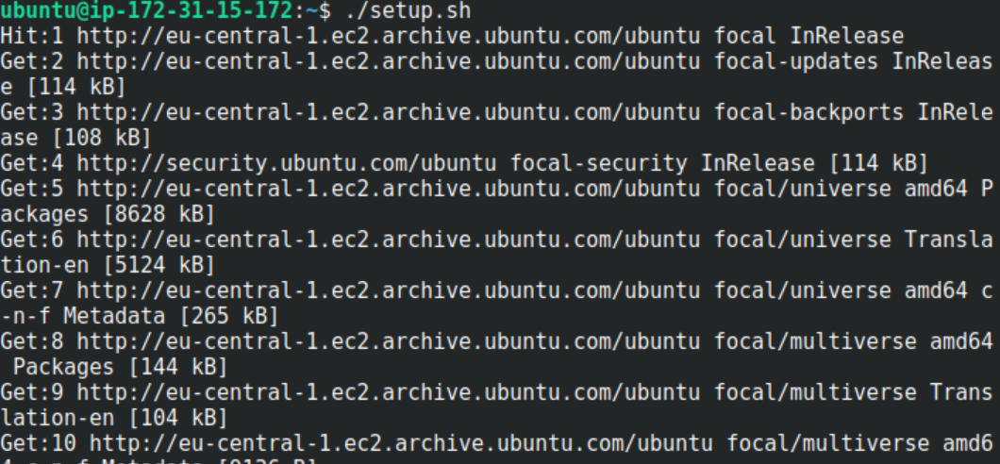

Далі я створюю html файл, змінюю йому дозволи та переміщаю у іншу папку для запуску


Заповнюю цей файл

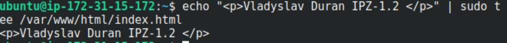

Запущена сторінка

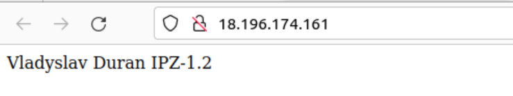