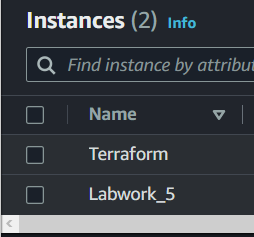

# Лабораторна робота №5. Деплой проекту на AWS EC2

## План:
 1. Зареєструватись на AWS.
 2. Створити інстанс EC2.
 3. Задеплоїти проект (може бути html сторінка) і скинути посилання в звіт для можливості перегляду.

---
Виконав студент ІІІ курсу

Напрям ІПЗ, група 1.2

Дуран Владислав Юрійович

---

### 1. Зареєструватись на AWS.

У мене вже був акаунт на AWS, тому перше завдання було виконаним

Для виконання другого завдання знаходимо EC2 у графічному інтерфейсі


### 2. Створити інстанс EC2.

Спочатку треба ввести ім'я інстансу, я вибрав Labwork5

Далі вибираємо операційну систему


Вибираємо тип інстансу


Переходимо до налаштувань мережі,де даємо доступ через SSH та дозволяємо HTTP трафік


Далі генеруємо SSH ключ для доступу, також можна було вибрати для підключення вже існуючі ключі


Натискаємо на Launch Instance і переходимо у вкладку Instances



Бачимо, що наш інстанс створено

Після цього вибираємо його(просто клік мишею) та тиснемо зверху на кнопку Connect

### 3. Задеплоїти проект (може бути html сторінка) і скинути посилання в звіт для можливості перегляду.

Входимо у термінал ОС, яку ми встановили раніше


Тепер нам треба встановити сервер (nginx або apache). Я вибрав nginx

Встановив за допомогою команд

```
sudo apt update
sudo apt-get install nginx
```

Далі я створив файл, дав йому потрібні дозволи

```
touch index.html
sudo chmod 400 index.html
```

Після створення файлу, я створив папку lab5 та перемістив туди файл

```
sudo mkdir -p /var/www/lab5/html
sudo mv -i index.html /var/www/lab5/html
```

Далі я заповнив свій html файл


Написав конфіг сервера


Також я змінював дефолтний конфіг nginx, що знаходиться у /etc/nginx/nginx.conf

У ньому треба було прибрати коментар з рядка, де було вказано
```
...
http{
    ...
    # server_names_hash_bucket_size_64;
    ...
}
...
```

Після цих дій я запустив сервер (на скріні показано,що я змінював конфіги та заповнював сторінку)


Вигляд запущеної сторінки:


[Лінк на сайт](http://54.93.40.240)