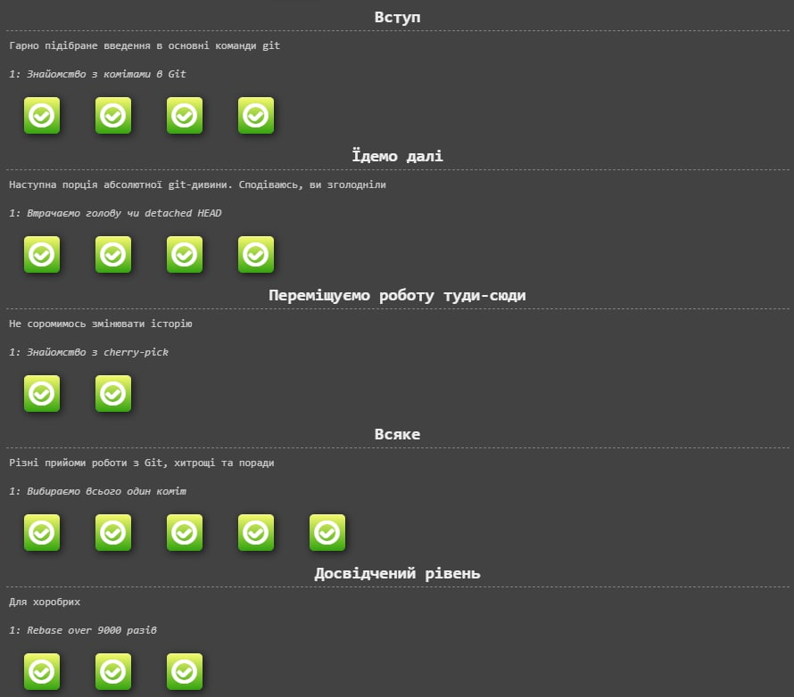

# Лабораторна робота №2

# Тема: "Основні команди системи контролю версій Git"

Виконав студент ІІІ курсу
Напрям "ІПЗ" група І
Дуран Владислав Юрійович

# План:
1) Пройти гру Git Learn та зробити скріншоти пройдених рівнів.
    
    
2) Зробити git init папки із файлом  hello.txt та bash скриптом.
    
3) Зробити git commit.
    
4) Зробити git push у віддалений репозиторій у вітку lab_works_one_two.
    
5) Додати в файл Readme звіт до лабораторної, щоб його можна було передивлятись на репозиторію коли переходиш у вітку.